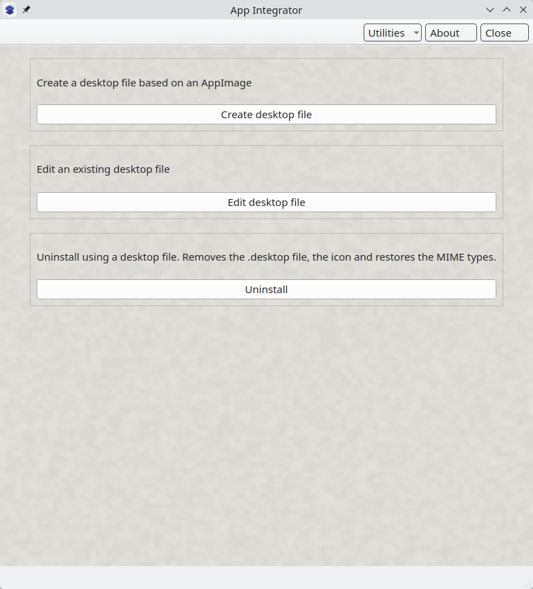
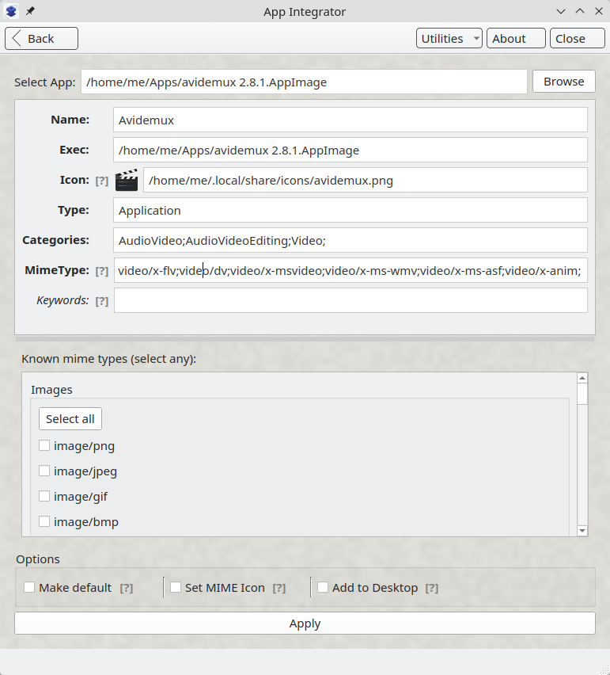
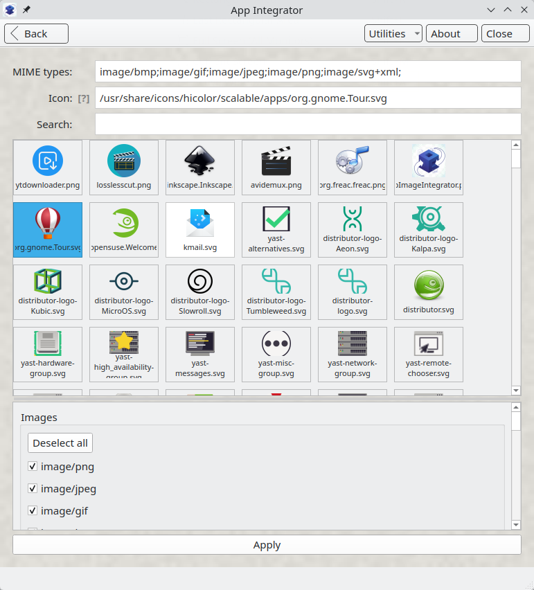
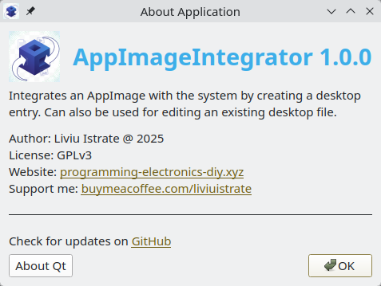

[](https://codeberg.org/silo0074/AppImageIntegrator)
[](./LICENSE)
[](https://codeberg.org/silo0074/AppImageIntegrator/releases)

# AppImage Integrator

**AppImage Integrator** is a lightweight utility designed for Linux users to "install" standalone AppImages into the desktop environment by creating desktop entries and associating MIME types, so your portable applications feel like native system installs.

---

## 🚀 Features

* **Native Desktop Integration**: Automatically generates `.desktop` files in your local applications folder.
* **Icon Browser & Management**: Features a built-in icon browser with search functionality to help you find and change the icon for desired MIME types that shows in file managers.
* **MIME Type Association**: Link specific file extensions to your AppImages so they appear in "Open With" menus.
* **Desktop file editor**: Existing .desktop files can be edited, useful for Wine apps.
* **MIME Finder Tool**: Includes a dedicated drag-and-drop utility to identify file types using the system's `QMimeDatabase`.
* **Clean Uninstall**: Safely removes desktop files and associated icons while restoring original MIME associations.

---

<br>

| Menu Screen | Install AppImage |
| :---: | :---: |
|  |  |

<details>
<summary><b>Click to see more screenshots</b></summary>

#### Mime Icon


#### About Screen


</details>


## 💡 Usage

After downloading the AppImage, right-click it and under **Properties -> Permissions**, check the **Execute** right. You can integrate the app itself the same way you would with other AppImages.
> [!TIP]
> To easily find your AppImage apps, I recommend placing them under `/home/youruser/Apps`.


## 📥 Download

The application binary can be downloaded as an AppImage from the [Releases](https://codeberg.org/silo0074/AppImageIntegrator/releases) section.

To verify the integrity of the download, run:

```bash
sha256sum -c AppImageIntegrator-x86_64.AppImage.sha256
```

Make it executable:
```bash
chmod +x AppImageIntegrator-x86_64.AppImage
```


## 🔨 Compiling

If you prefer to build the AppImage yourself, you can use the provided automation script: [build_appimage.sh](./build_appimage.sh).

1. **Clone the repository**:
   ```bash
   git clone https://codeberg.org/silo0074/AppImageIntegrator.git
   cd AppImageIntegrator
   ```

2. **Run the script**:
   ```bash
   ./build_appimage.sh
   ```


## 📖 How to Use

**Integrate a New App**

* Launch the application and select "Create desktop file".
* Browse for your AppImage file.
* The tool will automatically parse the AppImage for metadata.
* Adjust the Name, Icon, and MIME Types in the dynamic form.
* Click Apply.

<br>

## 🛠️ Built With

* **[Python 3.10+](https://www.python.org/)** - The core programming language.
* **[Qt 6 / PySide6](https://doc.qt.io/qtforpython-6/)** - Used for the graphical user interface and system integration logic.
* **[Qt Designer](https://doc.qt.io/qt-6/qtdesigner-manual.html)** - Used for crafting the XML-based UI layouts (`form.ui`).

<br>

## ❤️ Donations

<a href="https://www.buymeacoffee.com/liviuistrate" target="_blank">
  
</a>
  
